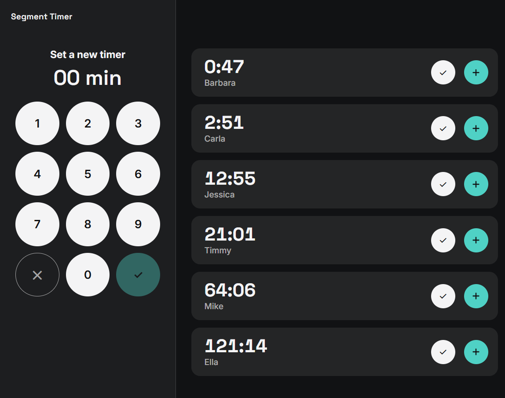

# Segment Timer

Segment Timer is a browser-based multi-timer application. Type a duration on the keypad, give the timer a name, and it counts down alongside all your others, with the least time left at the top. When a timer hits zero it goes fullscreen, keeps counting into negative time, and loops an alarm until you mark it done or add more time.

It runs entirely in the browser from a single `index.html`, with no server, no accounts and no dependencies. 

[](https://revolut.me/leonampa) [](LICENSE)

### [Try out the Demo](https://leonampa.github.io/segment-timer/demo)



## Where it works

Anywhere you're juggling several timed things at once and need to know *which one* is up:

- **Hair salons and barbershops**: colour processing, toner, treatments and blow-dries running in parallel.
- **Beauty and treatment rooms**: facials, waxing, lash and nail services.
- **Therapy and appointment-based practices**: session timing. Names stay on the device and nothing is sent anywhere.
- **Live events**: speakers, panels and stage segments.
- **Classrooms, workshops and kitchens**: group work, lab steps, batches.

## Features

- **Any number of timers, each with a name**: a client, a speaker, a dish. Type the minutes on the keypad, then name it.
- **Sorted by urgency**: the least time left is always at the top.
- **Overtime alert**: when a timer hits zero it jumps to fullscreen, keeps counting into the negative, and loops an alarm sound until you deal with it.
- **Multiple overtime timers at once** sit side by side as slices. Once there are too many to fit, the row scrolls horizontally.
- **Add time**: on a running timer, the added minutes are added on top. On a timer that's already over time, it restarts from the amount you add (-1:20 plus 1 min becomes +1:00, not -0:20).
- **Survives refreshes, closed tabs, and background throttling.** Each timer stores its absolute end time rather than a counter, so the remaining time is always recomputed from the clock.
- **Translatable in one place**: every user-facing string lives in a single `STRINGS` object at the top of the file.
- **Keyboard accessible**, with visible focus rings.

## Setup

Put these files in the same folder:

| File | What it is |
| --- | --- |
| `index.html` | The app |
| `Inter.ttf` | [Inter](https://rsms.me/inter/), variable font |
| `SpaceGrotesk.ttf` | [Space Grotesk](https://fonts.google.com/specimen/Space+Grotesk), variable font |
| `timer.mp3` | Your alarm sound |

Both fonts are under the SIL Open Font License. If a font file is missing, the app falls back to your system font.

`timer.mp3` is played in a loop while any timer is over time, so a short clip (about 1 second) works best.


## Notes

- **Where timers are stored:** in your browser's `localStorage`. They persist on the same browser and device, but are not synced across devices.
- **Timers only run while a tab is open.** Close the tab and nothing can play or alert, but when you reopen it the times are correct, and anything that expired in the meantime alerts immediately.
- **Autoplay rules:** browsers block sound until you've interacted with the page at least once. In normal use you'll already have clicked the keypad. If an alarm is blocked after a reload, it starts as soon as you click anywhere.
- **Browser support:** current Chrome, Edge, Safari 16+, and Firefox 110+. The fullscreen slices use CSS container query units.

## Customising

### Theme

Everything is driven by a handful of CSS variables at the top of the `<style>` block:

```css
:root{
  --ink:#111214;     /* page and panel background */
  --paper:#f4f4f5;   /* text, and neutral button fill */
  --accent:#4fd1c5;  /* confirm and add-time */
  --alert:#ff5b45;   /* overtime */
}
```

If you change the colors, check the contrast between text and its background.

### Translating

Open `index.html` and edit the values in the `STRINGS` object near the top. Functions receive the pieces they need, so you can reorder words or handle plurals for your language. Also set `<html lang="...">` to your language code.
